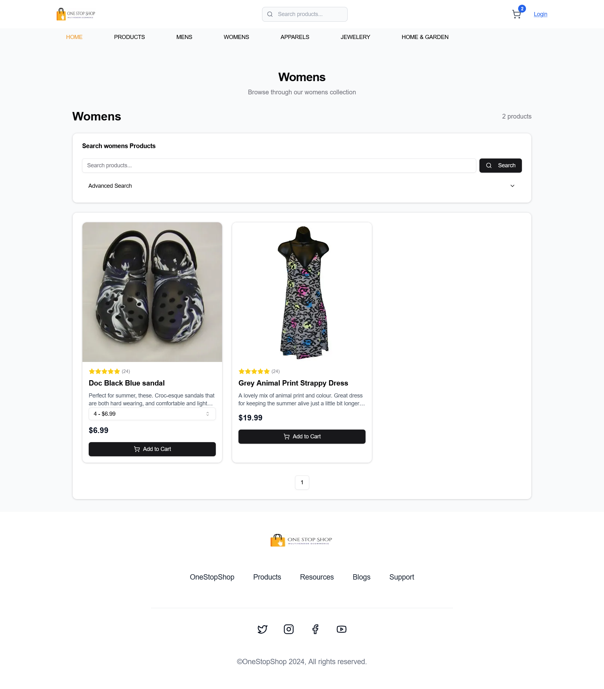

# NextJS Ecommerce with Shopify Integration

## Overview

This project is a modern ecommerce platform built with NextJS, TypeScript, and TailwindCSS. It features seamless data migration from WooCommerce to Shopify, custom API routes, and maintains SEO-friendly URL patterns.

## Screenshots

<div align="center">
  <p align="center"><strong>Homepage → Products → Category → Cart → Checkout → Payment → Success</strong></p>
  
  
  
  
  
  
  
</div>

## Features

- Dynamic data transformation from WooCommerce to Shopify
- Custom NextJS API routes
- SEO-optimized URL structure matching WordPress patterns
- Responsive UI built with shadcn components
- Stripe payment integration
- Comprehensive testing suite using JEST and Cypress

## Tech Stack

- NextJS
- TypeScript
- TailwindCSS
- Shopify
- Stripe
- JEST
- Cypress

## Getting Started

### Prerequisites

- Node.js (version 20.4.0)
- npm or yarn
- Shopify account
- Stripe account

### Installation

1. Clone the repository
   ```
   git clone https://github.com/samikaran/fullstack-ecommerce-nextjs-shopify.git
   ```
2. Install dependencies
   ```
   npm install
   ```
   or
   ```
   yarn install
   ```
3. Set up environment variables (create a `.env.local` file in the root directory)
   ```
   SHOPIFY_API_KEY=your_shopify_api_key
   SHOPIFY_API_SECRET_KEY=your_shopify_secret_key
   SHOPIFY_STOREFRONT_ACCESS_TOKEN=your_shopify_storefront_access_token
   NEXT_PUBLIC_SHOPIFY_STORE_ENDPOINT=your_shopify_store_endpoint
   NEXT_PUBLIC_STRIPE_PUBLIC_KEY=your_stripe_public_key
   STRIPE_SECRET_KEY=your_stripe_secret_key
   NEXT_PUBLIC_SITE_DOMAIN=your_main domain
   ```

### Running the Application

```
npm run dev
```

or

```
yarn dev
```

Visit `http://localhost:3000` to view the application.

## Testing

Run unit tests:

```
npm test
```

Run end-to-end tests:

```
npm run cypress
```

## Deployment

### Deploying to Vercel

This project can be easily deployed to Vercel, which is optimized for NextJS applications. Follow these steps:

1. Sign up for a Vercel account at https://vercel.com if you haven't already.

2. Install the Vercel CLI:

   ```
   npm i -g vercel
   ```

3. From your project directory, run:

   ```
   vercel
   ```

4. Follow the prompts to link your project to Vercel.

5. Configure your environment variables in the Vercel dashboard:

   - Go to your project settings
   - Navigate to the "Environment Variables" section
   - Add your `SHOPIFY_API_KEY`, `STRIPE_SECRET_KEY`, `SHOPIFY_STOREFRONT_ACCESS_TOKEN`, `NEXT_PUBLIC_SHOPIFY_STORE_ENDPOINT`, `NEXT_PUBLIC_STRIPE_PUBLIC_KEY`, `STRIPE_SECRET_KEY` and `NEXT_PUBLIC_SITE_DOMAIN`

6. For subsequent deployments, you can use:
   ```
   vercel --prod
   ```

Vercel will automatically detect your NextJS project and apply the optimal build settings. Your app will be deployed and you'll receive a URL for your live site.

### Continuous Deployment

To set up continuous deployment:

1. Connect your GitHub repository to Vercel.
2. Vercel will automatically deploy your app when you push changes to your main branch.
3. You can configure additional options like preview deployments for pull requests in the Vercel dashboard.

Remember to manage your environment variables securely and never commit them to your repository.

## Contact

[dev.samikaran@gmail.com]

Project Link: [https://github.com/samikaran/fullstack-ecommerce-nextjs-shopify](https://github.com/samikaran/fullstack-ecommerce-nextjs-shopify)
